---
header-includes:
  - \usepackage{fontspec}
  - \setmainfont{Arial}
  - \setmonofont{JetBrains Mono}
  - \usepackage{xcolor}
  - \usepackage{tcolorbox}
  - \definecolor{codebg}{HTML}{e8f4fd}
  - \definecolor{codetext}{HTML}{1a2f4a}
  - \renewenvironment{Shaded}{\begin{tcolorbox}[colback=codebg, colupper=codetext, colframe=codebg, arc=6pt, boxrule=0pt, left=6pt, right=6pt, top=4pt, bottom=4pt]}{\end{tcolorbox}}
---
# БЫСТРЫЕ АЛГОРИТМЫ

## 1. Умножение матриц по Винограду.

В 1987 году Дон Копперсмит и Виноград опубликовали метод, содержащий O($n^{2.376}$) операций и улучшили его в 2011 до O($n^{2.373}$ ).

Скалярное произведение, по замыслу Винограда, можно произвести:

$c_{ij} = \sum_{k=1}^{q/2} \left(a_{i,2k-1} + b_{2k,j}\right)\left(a_{i,2k} + b_{2k-1,j}\right) - \sum_{k=1}^{q/2} a_{i,2k-1} a_{i,2k} - \sum_{k=1}^{q/2} b_{2k-1,j} b_{2k,j}$ (3)

Казалось бы, это только увеличит количество арифметических операций по сравнению с классическим методом, однако Виноград предложил находить второе и третье слагаемые в (3) на предварительном этапе вычислений, заранее для каждой строки матрицы A и столбца B соответственно. Так, вычислив единожды для строки i  матрицы $A$ значение выражения $\sum_{k=1}^{q/2} a_{i,2k-1} a_{i,2k}$ его можно далее использовать $m$ раз при нахождении элементов $i$-ой строчки матрицы $C$. Ведь данное выражение участвует в определении $c_{ij}$ по ф. (3) для выбранного $i$ и $1 \leq j \leq m$. Аналогично, вычислив единожды для столбца $j$ матрицы $B$ значение выражения $\sum_{k=1}^{q/2} b_{2k-1,j} b_{2k,j}$ его можно далее использовать $n$ раз при нахождении элементов $j$-ого столбца матрицы $C$. Ведь данное выражение участвует в определении $c_{ij}$ по ф. (3) для выбранного $j$ и $1 \leq i \leq n$.

 Подготовка матрицы A в методе Винограда
 
```text
for i=1:n 
	row(i)=A(i,1)A(i,2) 
	for k=2:q/2 
		row(i)=row(i)+A(i,2k-1)A(i,2k) 
	endfor 
endfor
```

Подготовка матрицы B в методе Винограда

```text
for j=1:m 
	col(j)=B(1,j)B(2,j) 
	for k=2:q/2 
		col(j)=col(j)+B(2k-1,j)B(2k,j) 
	endfor 
endfor
```

Умножение матриц по методу Винограда

```text
for i=1:n 
	for j=1:m 
		C(i,j)=-row(i)-col(j) 
		for k=1:q/2 
			C(i,j)=C(i,j)+(A(i,2k-1)+B(2k,j))·(A(i,2k)+B(2k-1,j)) 
		endfor 
	endfor 
endfor
```

Наглядный пример: умножение матриц 2×2 по Винограду 

Исходные матрицы 

$$ A = \begin{pmatrix} 3 & 1 \\ 2 & 4 \end{pmatrix}, \quad B = \begin{pmatrix} 5 & 7 \\ 6 & 2 \end{pmatrix}$$ 

Шаг 1. Предвычисления для строк A 

$$ \text{rowFactor}[i] = \sum_{k=1}^{1} a_{i,2k-1} \cdot a_{i,2k} $$ $$ \text{rowFactor}[0] = a_{0,1} \cdot a_{0,2} = 3 \cdot 1 = 3 $$ 

$$ \text{rowFactor}[1] = a_{1,1} \cdot a_{1,2} = 2 \cdot 4 = 8 $$

Шаг 2. Предвычисления для столбцов B 

$$ \text{colFactor}[j] = \sum_{k=1}^{1} b_{2k-1,j} \cdot b_{2k,j} $$

$$ \text{colFactor}[0] = b_{1,1} \cdot b_{2,1} = 5 \cdot 6 = 30 $$ 

$$ \text{colFactor}[1] = b_{1,2} \cdot b_{2,2} = 7 \cdot 2 = 14 $$

Шаг 3. Вычисление $c_{11}$ 

$$ c_{11} = (a_{0,1} + b_{2,1})(a_{0,2} + b_{1,1}) - \text{rowFactor}[0] - \text{colFactor}[0] $$ 

$$ = (3 + 6)(1 + 5) - 3 - 30 = 9 \cdot 6 - 33 = 54 - 33 = 21 $$ 

Проверка: $3 \cdot 5 + 1 \cdot 6 = 15 + 6 = 21$ ✓ 

Шаг 4. Вычисление $c_{12}$ 

$$ c_{12} = (a_{0,1} + b_{2,2})(a_{0,2} + b_{1,2}) - \text{rowFactor}[0] - \text{colFactor}[1] $$ 

$$ = (3 + 2)(1 + 7) - 3 - 14 = 5 \cdot 8 - 17 = 40 - 17 = 23 $$ 

Проверка: $3 \cdot 7 + 1 \cdot 2 = 21 + 2 = 23$ ✓ 

Шаг 5. Вычисление $c_{21}$ 

$$ c_{21} = (a_{1,1} + b_{2,1})(a_{1,2} + b_{1,1}) - \text{rowFactor}[1] - \text{colFactor}[0] $$ 

$$ = (2 + 6)(4 + 5) - 8 - 30 = 8 \cdot 9 - 38 = 72 - 38 = 34 $$ 

Проверка: $2 \cdot 5 + 4 \cdot 6 = 10 + 24 = 34$ ✓ 

Шаг 6. Вычисление $c_{22}$ 

$$ c_{22} = (a_{1,1} + b_{2,2})(a_{1,2} + b_{1,2}) - \text{rowFactor}[1] - \text{colFactor}[1] $$ 

$$ = (2 + 2)(4 + 7) - 8 - 14 = 4 \cdot 11 - 22 = 44 - 22 = 22 $$ 

Проверка: $2 \cdot 7 + 4 \cdot 2 = 14 + 8 = 22$ ✓ 

Результат 

$$ C = \begin{pmatrix} 21 & 23 \\ 34 & 22 \end{pmatrix} $$

# МОДЕЛИ В ТЕОРИИ ПАРАЛЛЕЛЬНЫХ ВЫЧИСЛЕНИЙ

## 2. Классификация параллельных вычислительных систем по Флинну.

**Модель (классификация) Флинна 1966 г.**

данные, команды $\to$  ЭВМ 

**Классификация:**
$$
\begin{array}{|c|c|c|}
\hline
\text{команды/потоки} & \text{одна команда} & \text{много команд} \\
\hline
\text{один поток} & \text{однопроц. ЭВМ (SISD)} & \text{конвейерные ЭВМ (MISD)} \\
\hline
\text{много потоков} & \text{векторные (SIMD)} & \text{многопроц. ЭВМ (MIMD)} \\
\hline
\end{array}
$$

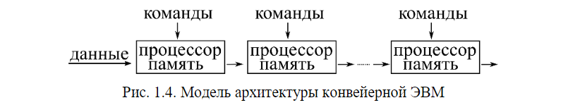

## 3. Классификация параллельных вычислительных систем по Хокни.

**Классификация Хокни для MIMD**

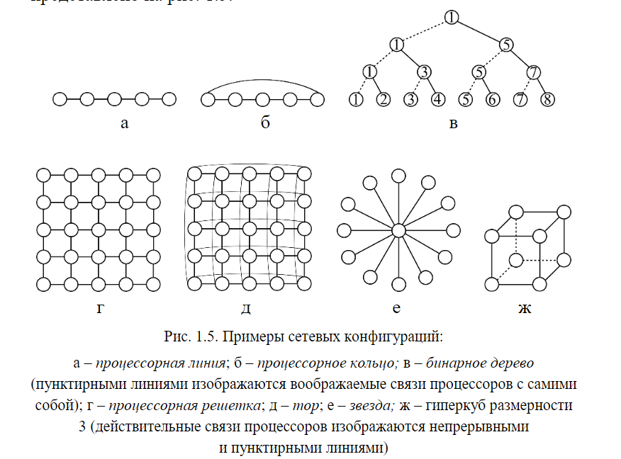

Конвейерные ЭВМ Хокни отнес к многопроцессорным, оставив класс MISD пу- стым.

1. Конвейерные (**!Проблема взаимного исключения!**)
	Смысл конвейеризации состоит в одновременном исполнении разных команд над различными фрагментами одного потока данных. При этом процессоров оказывается несколько, каждый со своей памятью.
2. Переключаемые - все процессоры соединены со всеми через особое устройство – переключатель
	1. С одной памятью
	2. С распределенной памятью
	Переключаемые в свою очередь разделяются на ЭВМ с общей и распределенной памятью. В первом случае процессоры работают над общей памятью и коммуникации между ними осуществляются через нее. При этом в ходе вычислений необходимо регулировать очередность доступа к общим данным. Во втором – память у всех процессоров локальная и указанной проблемы не возникает, однако технически обеспечить полносвязаную топологию коммуникаций при большом количестве процессоров сложно.
3. Сети - (процессор соединяется с определенным количеством соседей)
	1. Процессорная линия (частный случай конвейерного)
	2. Процессорное кольцо
	3. Процессорная решетка
	4. Тор (бублик)
	5. Гиперкуб
	6. Бинарное дерево (частный случай гиперкуба)
	7. Звезда
	8. 
Гиперкуб с размерностью $k$ содержит $p = 2^k$ вершин

## 4. !Модели представления параллельных алгоритмов.!

**По Маркову под алгоритмом будем понимать** ясные предписания, задающие вычислительный процесс, идущий от варьируемых начальных данных к искомому результату

**Свойства алгоритмов:**
 - **Детерминированность (результативность)** - за конечное количество шагов алгоритм либо приводит к результату, либо к убежденности невозможности получить результат.
 - **Дискретность** - подразумевает, что алгоритм должен разбиваться на шаги
 - **Масса** - схожие задачи должны допускать решение одним алгоритмом
 - **Однозначность** - алгоритм не допускает двух разных трактовок

**Модели параллельных алгоритмов:**
#### 1. **Задача/Канал** 

Под **задачей** будем понимать последовательный набор инструкций и данных, над которыми инструкции выполняются (Кружочки)

Параллельность обеспечивается за счет того, что одновременно выполняются несколько задач

**Канал** - средство коммуникации между задачами (Стрелочки)

**Два правила каналов:**

1. Перемещение данных по каналу всегда в одну сторону
2. Данные по каналу перемещаются в соответствии с правилом - первый вошел, первый вышел (Вагончики)

В ходе работы алгоритма задачи могут появляться и упраздняться

**Cвойства коммуникации:**

1. **Синхронная/Асинхронная коммуникация**

Операции **приема** и **отправки**

Под **синхронной коммуникацией** будем понимать ситуацию, когда следующая за этой операцией инструкция не выполняется до окончания коммуникации

В **асинхронном** случае следующая инструкция после коммуникации выполняется сразу после начала этой коммуникации

2. **Локальные/Глобальные коммуникации**

$p$ - число задач

$\text{соседи} \leq [\log_{2}{p}]_{\text{до ближайщего большого числа}}$ , то локальная

3. **Статические/Динамические коммуникации**

Если топология коммуникации алгоритма меняется по ходу его выполнения, то такие коммуникации называются динамические

4. **Регулярные/Нерегулярные коммуникации**

Если коммуникация алгоритма не отображается на стандартную сетевую топология, то она нерегулярная

#### 2. **Джин Голуб**

Модель основана на аннотации языка Маркова + Операторы коммуникации
Операторы:
- send (А, let), где A - что посылаем, let - куда посылаем

Из всех топологий коммуникаций Голуб особо выделяет четыре:

**Линия и кольцо**

$p$ - число задач

$1 \leq \mu \leq p$ - число процессов

let - $\mu-1$

right - $\mu+1$

**Решетка и тор**

$(\mu,\lambda)$ - номер задачи

north $(\mu-1,\lambda)$, south $(\mu+1,\lambda)$, west $(\mu,\lambda-1)$, east 

$(\mu,\lambda+1)$

- recv(A, let), где A - куда принимаем, let - от кого принимаем

При записи параллельного алгоритма каждой задаче должны быть поставлены в соответствии инструкции, которая она выполняет, и данные, над которыми она работает

По Голобу алгоритму предваряется инициализация

Инициализация - $p$ число задач, $\mu$ или $\mu - 1$ - номер задачи, локальные данные

У Голоба нет записи глобальных алгоритмов

**Механизм распределения начальных данных между задачами**:

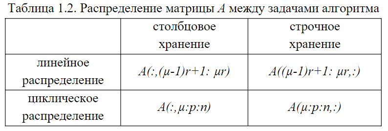

Пусть необходимо распределить n элементов вектора a(1:n) между p задачами.

1. Линейное распределение

Есть массив $a(1:n)$, $r = \frac{n}{p}$

В ходу инициализации $\mu - a((\mu-1),r+1)$

```text
if mu = 1 then
	for i = 2 : p
		send(a((i-1)r+1:in), i)
	endfor
else
	recv(a(1:n),1)
endif
```

2. **Циклическое распределение**

$\mu - a(\mu:p:n)$

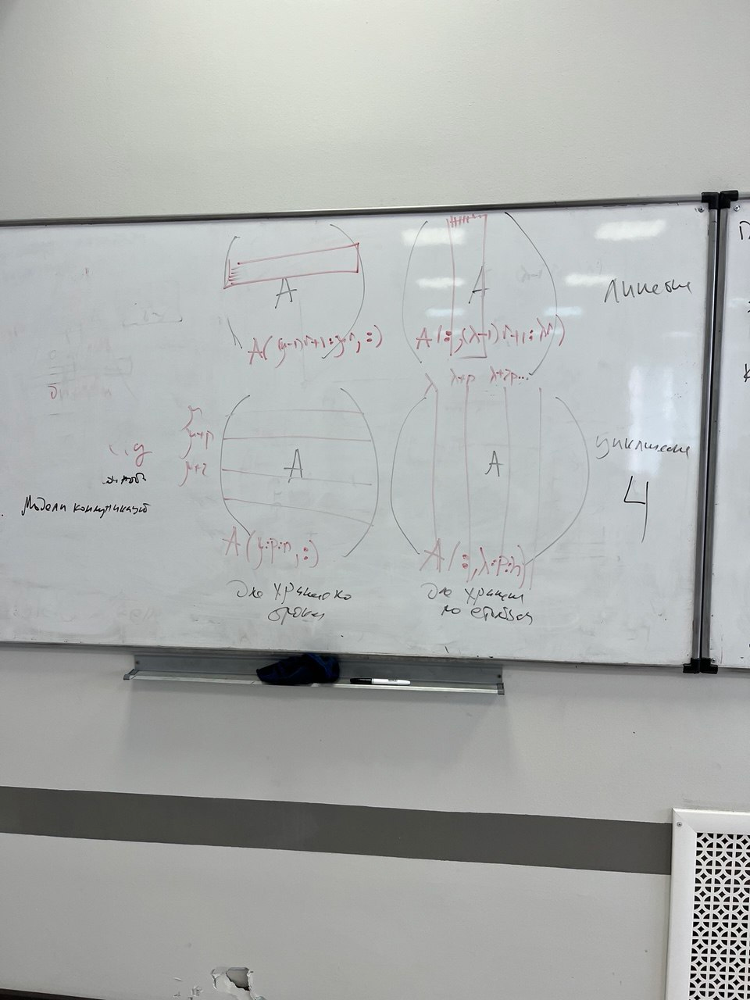

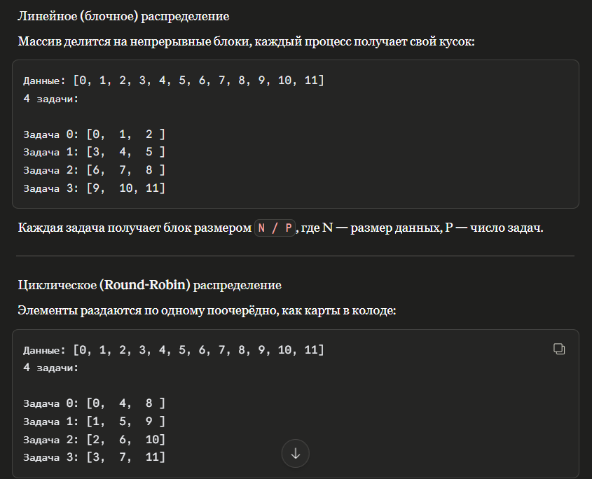

## 5. !Сети как модели вычислительных процессов (определение, свойства).!

**Вычислительный процесс** - это действия по алгоритму на определенной вычислительной системе некоторое время

**Сетью назовем - $N = (P,T, F)$**

P - непустое конечное множество мест (Круги на графе)

T - непустое конечное множество переходов (Отрезки на графе)

F - функция инцендентности, имеет область определение: $F : P \times T \cup T \times P \to N$

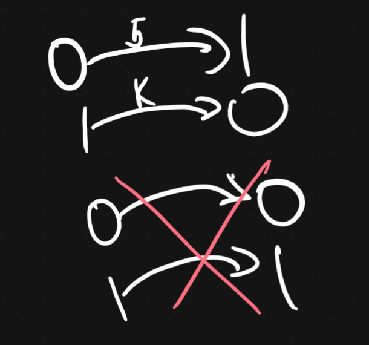

**Свойства сети:** 

1. Переходы и места разные множества $P \cap T = \emptyset$

Множества мест и переходов не пересекаются, являясь разными множествами по своей сути. Переходы обычно связывают с дей- ствиями вычислительного процесса, а места с условиями производ- ства этих действий.

2. $\forall_{p} \in P \space \exists_{t} \in T \quad \text{либо} \quad F(p,t) \neq 0 \quad \text{либо} \quad F(t,p) \neq 0$

Любое место сети связано хотя бы с одним переходом. Либо дуга ведет из такого перехода в данное место, либо из места в такой пе- реход

3. $\forall_{t} \in T \space \exists_{p} \in P \quad \text{либо} \quad F(t,p) \neq 0 \quad \text{либо} \quad F(p,t) \neq 0$

Аналогично для переходов, Любой переход сети связан хотя бы с одним местом. Либо из такого места ведет дуга в данный переход, либо из перехода в такое место.

4. $\forall_{p_{1},p_{2}} \in P \text \quad {если} \quad (*p_{1} = *p_{2}) \space \text{и} \space (p*_{1} = p*_{2}) \space\text{то} \space p_{1} = p_{2}$

где $*p - \text{множество входных переходов p}$ , $p* - \text{множество выходных переходов p}$

Согласно последнему свойству сети отрицается необходимость в существовании двух разных мест одинаково инцидентных одними и теми же переходам. Причем для переходов аналогичное свойство не формулируется.

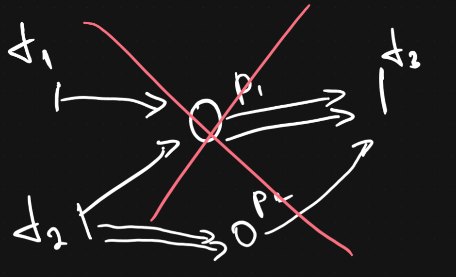

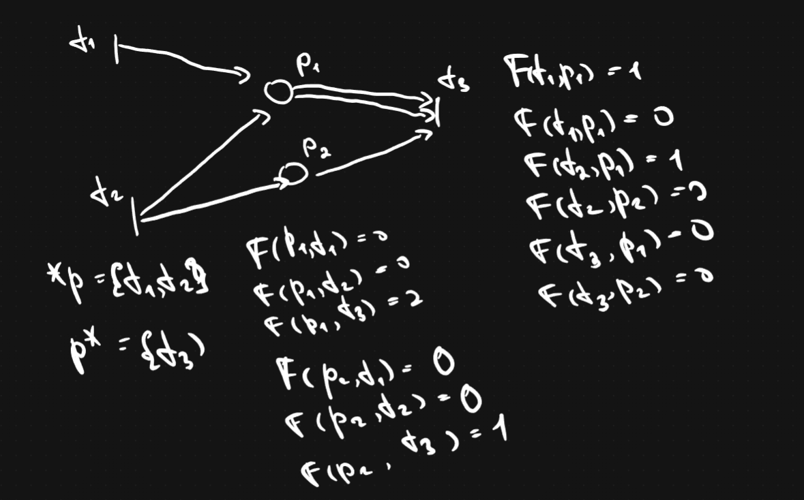

## 6. !Сети Петри как модели вычислительных процессов (определения, формализм).!

Сеть Петри $PN = (P,T,F,M)$

$M \space\text{- множество  } (M:P\to\mathbb{N})$ - разметка сети.

$$
M = \begin{pmatrix}
M(p_{1}) \\
M(p_{2}) \\
\dots \\
M(p_{n})
\end{pmatrix}
$$

разметка меняется после срабатывания переходов.

Разметка есть функция, областью определения которой является множество мест, а областью значений – множество натуральных чи- сел с нулем. Графически значения разметки изображаются фиш- ками внутри мест.

**Условия срабатывания переходов:**
1. Переход $t$ - может (но не должен) сработать, если $\forall p \in *t \space M(p) \geq F(p,t)$ в векторном виде $M \geq *F(t)$

где $t*$ - множество входных мест перехода $t$

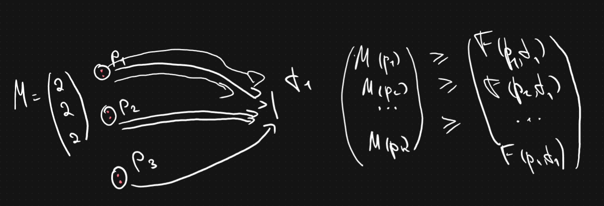

1. Допустим мог сработать и сработал, то меняется разметка
$\forall p \in P \space M'(p) = M(p) - F(p,t) + F(t,p)$, в векторном виде $M' = M - *F(t) + F^*(T)$

$$
\begin{pmatrix}
M(p_{1}) \\
M(p_{2}) \\
\dots \\
M(p_{n)}
\end{pmatrix} = \begin{pmatrix}
M(p_{1}) \\
M(p_{2}) \\
\dots \\
M(p_{n)}
\end{pmatrix} - 
\begin{pmatrix}
F(p_{1},t) \\
F(p_{2},t) \\
\dots \\
F(p_{n},t)
\end{pmatrix}
+
\begin{pmatrix}
F(t, p_{1}) \\
F(t, p_{2}) \\
\dots \\
F(t, p_{n})
\end{pmatrix}
$$

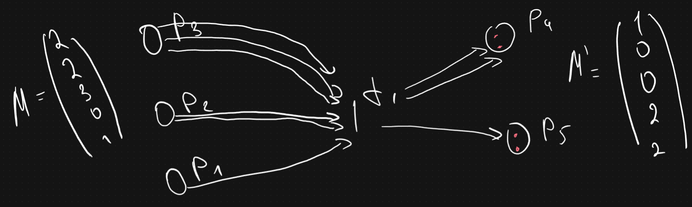

**Пример:**

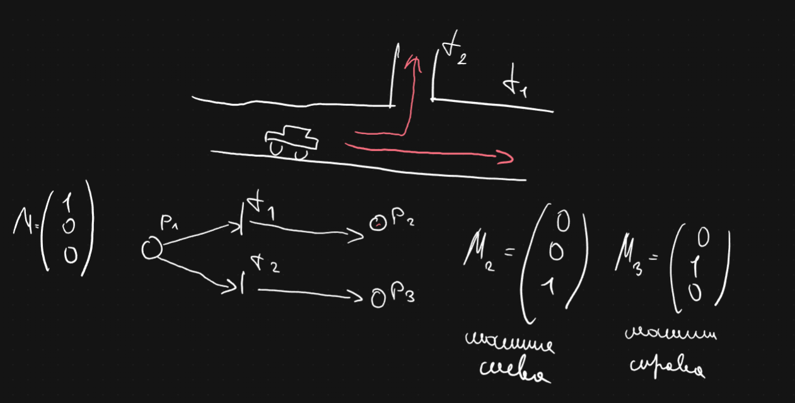

Закона сохранения фишек **НЕТ!**

**Работа всей сети Петри описывается:**

1. Множество сработающих переходов $\tau = \{t_{1} ,t_{2}\dots \}$

2. Множество достижимых разметок $R_{0} = (PN,M_{0})$

$M_{0}[t_{1} > M_{1}[t_{2}>M_{2}\dots M_{N}$

$M_{0}[t_{1} >M_{1}$ - бинарное отношение непосредственно на множестве разметок

$M_{0},M_{1}$ вступают в бинарное отношение непосредственного следования, если:

$(M_{0} \to *F(t_{1}))$ и $(M_{1} = M_{0} - *F(t_{1}) + F^*(t_{1}))$

# АВТОМАТИЧЕСКОЕ РАСПАРАЛЛЕЛИВАНИЕ

## 7. Автоматическое распараллеливание ациклических фрагментов последовательных программ (построение стандартного графа и графа зависимостей).

Любой указанный фрагмент допускает запись через операторы всего двух видов:
- Присваивание
- Условные переходы

**Этап I - Построение стандартного графа**

Будем различать два типа вершин стандартного графа:

1. **Преобразовать** - каждый соответствует одному или нескольким последовательно расположенных операторов присваивания, изображается на графе **прямоугольником**

2. **Распознаватель** - каждый соответствует строго одному оператору условного перехода, изображается на графе **окружностью**

**Дуги** на графе задаются бинарным отношением непосредственного следования на множестве операторов

Отметим, что из преобразователя выходит не более одной дуги

Из распознавателя не более двух, при этом дугу соответствующей истинности условия распознавателя маркируем 1, ложное 0

Вершину в которую не входит не одна дуга именуем **входной** вершиной стандартного графа

Вершину из которой не выходит не одна дуга именуем **выходной** вершиной стандартного графа

Пример: 

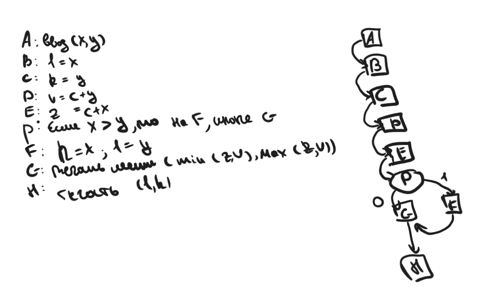

**Этап II - Построение графа зависимостей**

1. Информационная зависимость - вершина B информационно зависит от A, если {A и B находятся на одном пути стандартного графа из входной вершины в выходную(при чем A предшествует B)} и хотя бы один оператор из B использует значение переменной формируем хотя бы одним оператором из A. При этом отсутствует расположенная на одном пути, такая что меняется значение 

При построение графа зависимости в него переносятся вершины стандартного графа без изменений

2. Логическая зависимость - вершина B логически зависит от A, если {...} и существует другой путь на стандартном графе из входной вершины в выходную. Совпадающий с первым до вершины А включительно, далее отличающуюся от него и не содержащую B.

3. Конкуренционная зависимость - вершина B конкуренционно зависит от вершины A, если {...} и в каждой из вершин есть оператор присваивания меняющий значение некой общей переменной.

Отныне не различаем тип зависимости. Завершаем построение графа зависимости нанесение на него транзитивного замыкания зависимостей построенных к этому моменту.

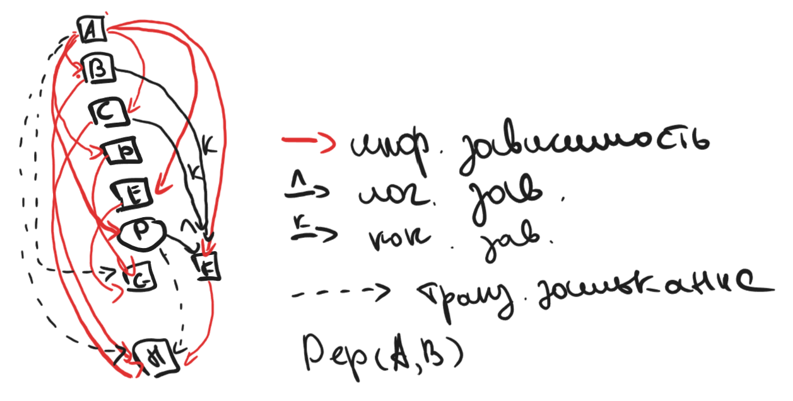

## 8. Автоматическое распараллеливание ациклических фрагментов последовательных программ (построение ЯПФ и параллельного алгоритма).

Этап III - Построение ярусно параллельной формы

1. A

2. B; C; D; E; P

3. F; G

4. H

**Алгоритм построения ЯПФ:**

**Шаг 1.** Заполнение первого яруса ЯПФ

В первый ярус помещаются $A \not \exists B \space Dep(B,A)$

**Шаг 2.** Пусть k ярусов заполнено, если $\forall A \exists_{i\leq k} \exists_{j\leq n_{k}} A = A_{ij}$, то ЯПФ построен, иначе шаг 3.

**Шаг 3.** В $k+1$ ярус помещаются такие вершины $A \quad Dep(B,A) \implies \exists_{i\leq k} \exists_{j\leq n_{k}} A_{ij} = B$, шаг 2.

В итоге на каждом ярусе окажутся исключительно независимые вершины, их операторы могут **выполняться одновременно**.

Этап IV - Построение параллельного алгоритма

Метод построения параллельного алгоритма:
Пусть известно $p$ - число задач и $1\leq\mu\leq p$ - номер задачи

**Шаг 1.** Распределение вершин первого яруса ЯПФ между задачами

$\mu \sim A_{1,\mu};A_{1,\mu+p};A_{1,\mu+2p}\dots$

**Шаг 2.** Пусть $k$ ярусов распределено

Если ЯПФ закончилось то алгоритм построен, иначе переходим на шаг 3.

**Шаг 3.** Распределение $k+1$ яруса ЯПФ по задачам параллельного алгоритма

$\mu \sim c(A_{k+1,\mu});A_{k+1,\mu};c(A_{k+1,\mu+p});A_{k+1,\mu+p};c(A_{k+1,\mu+2p});A_{k+1,\mu+2p}\dots$

Если функция $c(A)$ - истина, то мы исполняем операторы вершины за ней следующей. 

Если ложь, тогда операторы следующей вершины не выполняются, а проверяются значения функции cледующей за той вершиной. 

Если пока не определено, то вычислительный процесс прерывается, а $\mu-ая$ задача простаивает, пока значение $c(A)$ не станет определенным.

Переход на шаг 2.

## 9. Автоматическое распараллеливание ациклических фрагментов последовательных программ (формализм определения функции «c»).

**Формализм определения функции $c(A)$**
Если далее говорится о пути, то имеется ввиду стандартный граф
Говоря о зависимости имеется ввиду граф зависимостей
Пусть через вершину $A$ проходит $n$ путей из входной вершины в выходную - $\xi^1,\xi^2,\xi^3,\dots\xi^n$, тогда каждой ставим в соответствие $c^1,c^2,c^3,\dots c^n$, принимающие значения истинно, если вычислительный процесс идущей по этому пути дошел до вершины $A$. Ложь, если заведомо известно, что пошел или пойдет другим путем, не содержащим $A$.
$c^{i}$ - неопределенно, если не одно из предыдущих утверждений пока не верно. Тогда $c(A)$ есть дизъюнкция
Тогда $c(A) = с^{1} \cup c^2 \cup c^3 \dots \cup c^n$

Выделим на данном пути, от который $A$ зависит. Тогда $c(A_{k})$, где $1 \leq k \leq K$ $\implies c^i = c(A_{1}) \cap c(A_{2}) \cap \dots c(A_{K})$

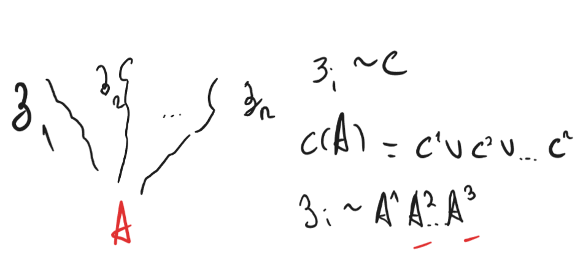

$$
с(A_{k})
\begin{cases}
c(A_{k}) \text{  -  Если $A_{k}$ - преобразователь}\\
c(A_{k} = 1) \text{  -  Если $A_{k}$ - распознаватель, и для реализации пути $\xi_{i}$ должно стать истинной}\\
c(A_{k} = 0) \text{  -  Если для реализизации пути $\xi_{i}$ условие распознавателя $A_{k}$ - ложно}
\end{cases}
$$

## 10. Распараллеливание циклических фрагментов программ (пространство итераций, ускорение, метод пирамид).

```text
(*)
for i_1 = 1:n_1
	for i_2 = 1:n_2
		...
			for i_k = 1:n_k
				T(i_1,i_2,...,i_k)
			end
		...
	end
end
```


$I = \{(i_{1},i_{2},\dots,i_{k})$ : $1\leq i_{g} \leq n_{g} \quad, 1 \leq g \leq k$

$I$ - пространство итераций

$(i_{1},i_{2},\dots,i_{k})$ - вектор из пространства итераций

1. **Отношение следования**

Развернем конструкцию $(*)$ следующим образом:

```text
(^) T(1,1,...,1); T(1,1,...,2); T(1,1,...,n_k); T(1,1,...2,1);... T(n_1,n_2,...,n_k)
```

Теперь строим стандартный граф. Ищем транзитивное замыкание отношение непосредственного следования, назовем его **отношения следования** на множестве вершин.

Между пространством итераций определенной **$(*)$** и телами из развернутой ациклической конструкции **(^)**, очевидно, существует взаимно однозначное отображение (биекция).

Тогда будем говорить, что вектор $i$ из пространства итераций (связанный с телом $T$) следует за вектором $i'$ (связанный с телом $T'$), если любая вершина из тела $T$ конструкции (^) следует за любой вершиной из тела $T'$.

2. **Отношение зависимость**

По развернутой ациклической конструкции **(^)** строим граф зависимость. 

Далее будем говорить, что вектор $i$ (относящий к $T$) зависит от $i'$ (относящийся к $T'$), если хотя бы одна вершина из $T$ зависит хотя бы от одной из $T'$.

Целью математической части лекции является поиск покрытия пространства итераций $\{I_{q}\}_{q=\overline{1,Q}}$

Если $I = \bigcup_{q=1}^{Q} I_{q}$, то $\{I_{q}\}_{q=\overline{1,Q}}$

При покрытии $I_{1} \cap I_{q} \neq \emptyset$

Наше цель найти покрытие, такое что любое его подмножество содержит исключительно независимые векторы.

В одном подмножестве покрытия итерации связанный с его векторами можно исполнять одновременно.

$$S = \frac{\prod_{j=1}^kn_{j}}{Q} = \frac{I_{\text{посл}}}{I_{\text{паралл}}} \to Max \quad - \quad \text{ускорение (speedup)}$$

Пример (?):

```text
for i = 1:10
	x(i) = f(x(i-1))
end
```

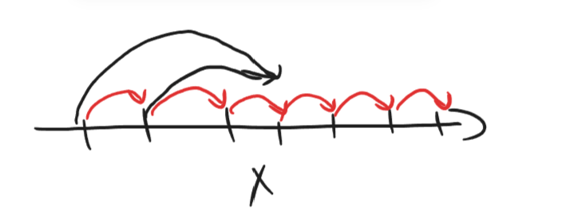

Для дальнейшего построения параллельного алгоритма необходимо соблюдений следующих условий:

1. Параметры цикла внутри его тела не должны изменяться

2. В теле цикла отсутствует переход за циклическую конструкцию

3. Параметры цикла в теле цикла участвуют только в линейных операциях

Пункт 2.2.1 - Метод пирамид

**Шаг1.** По циклической конструкции $(*)$ строится пространство итераций на нём вводится отношения следования и зависимость. 

На пространстве итераций выбираются вектора каждый из которых не зависит не от какого другого вектора этого пространства, назовем такие вектора **результирующими**.
 
**Шаг2.** Каждому такому вектору поставим во взаимное однозначное соответствие (биекция) одну задачу параллельного алгоритма.

Кроме указанного вектора отнесем к ней также все вектора пространства итераций от которых данные **результирующие** зависят.

**Шаг3.** Внутри каждой задачки упорядочим отнесенные к ней вектора в соответствие с отношением следования.

**Алгоритм построен.**

В отличие от других методов построения **Метод Пирамид** не характеризуется коммуникацией.

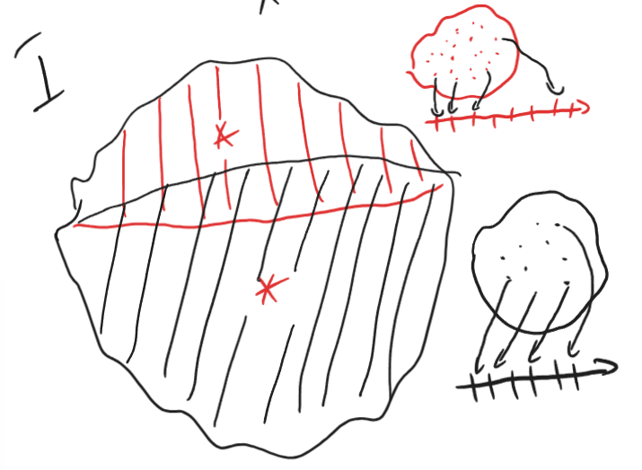

**Пример Метода пирамид**

**Последовательный алгоритм:**

```text
for i = 1:I
	for j = 1:J
		u(i,j) = f(u(i-1,j),u(i-1,j-1)mu(i-1,j+1))
	endfor
enfor
```


**Параллельный алгоритм:**

```text
for i = 1:I
	for j = max{1,mu-(I-i)tg(alpha)} : min{J,mu+(I-i)tg(beta)}
		u(i,j) = f(u(i-1,j),u(i-1,j-1)mu(i-1,j+1))
	endfor
endfor
```

$mu-(I-i)tg(alpha)$ - $j$ min

$mu+(I-i)tg(beta)$ - $j$ max

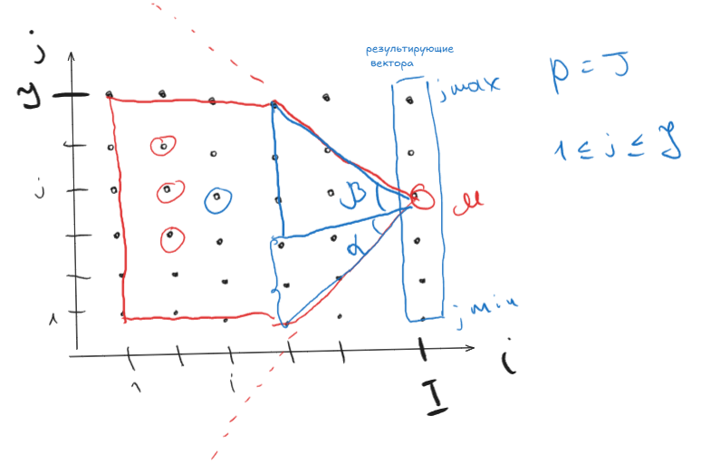

**Замечания**

1. Метод имеет смысл применять в 1) случае, а не 2):

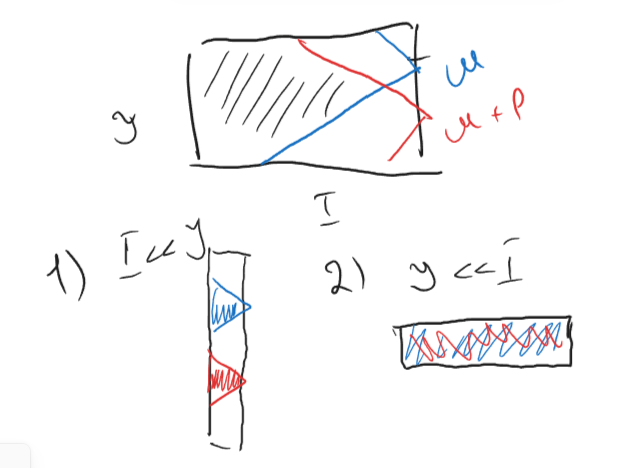

2. На практике задачи с близкими номерами $\mu$ принято объединять

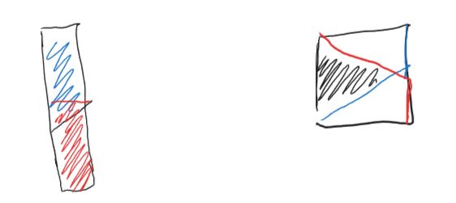

3. В отличии от остальных методов в данном допускается использование параметров цикла внутри цикла в нелинейных выражениях

## 11. Распараллеливание циклических фрагментов программ (пространство итераций, ускорение, метод параллелепипедов).

В отличии от всех остальных методов позволяет работать с простыми циклами

Последовательный алгоритм:

```text
for i = 1:10
	x(i) = f(x(i-4))
endfor
```

Параллельный алгоритм:

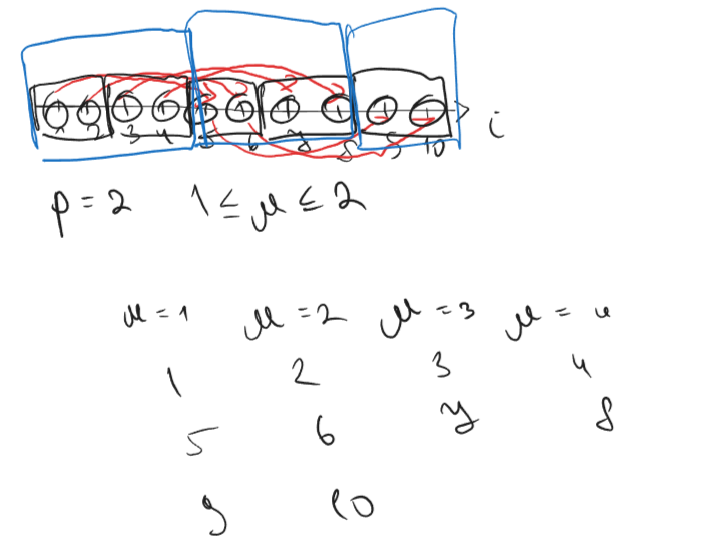

```text
for i = mu:4:10
	x(i) = f(x(i-4))
endfor
```

$$
S = \frac{10}{3}
$$

```text
for i_1 = 1:n_1
	for i_2 = 1:n_2
		...
			for i_k = 1:n_k
				T(i_1,i_2,...,i_k)
			endfor
		...
	endfor
endfor
```

**Шаг1.** Строим пространство итераций, наносим на него отношение следования и зависимости.

**Шаг2.** На пространстве итераций ищем различные покрытия, каждый из которых представляет из себя набор $k$ - мерных параллелепипедов.

**Шаг3.** Для каждого из этих покрытий выбираем параллелепипед максимального объема и на его ребрах строим новую систему координат.

Количество задач параллельного алгоритма будет равным числу векторов в выбранном промежутке.

Если длины сторон параллелепипеда равны $p_{1},p_{2},\dots p_{k}$ (где $p_i$ есть разность координат последнего и первого вектора по $i$ направлению + 1), то для прямоугольного параллелепипеда общее число задач есть: $p = \prod_{i=1}^k p_{i}$


За номер задачи примем координату вектора в выбранном параллелепипеде в новой система координат 

$(g_{1},g_{2},\dots g_{k})$

Может случится, что размерность выбранного параллелепипеда окажется меньше пространства итераций, в этом случае одна или несколько $p$ будут приняты за 1

А в номере задачи соответствующая ему координата также будет принята за единицу

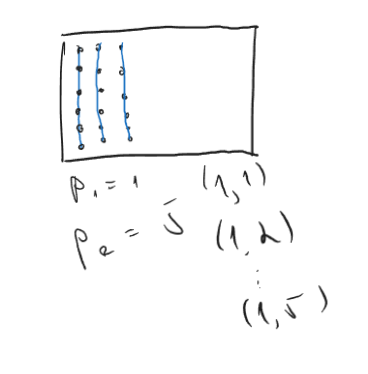

**Шаг4.** Отнесем к ведению каждой задачи не более одного вектора из каждого подмножества выбранного покрытия

Внутри каждой задачи совокупность отнесенных к ней векторов расположены в соответствии с отношением следования, таким образом:

```text
for i_1 = g_1:p_1:n_1
	for i_2 = g_2:p_2:n_2
		...
			for i_k = g_k:p_k:n_k
				T(i_1,i_2,...,i_k)
				+ коммуникация
			endfor
		...
	endfor
endfor
```

## 12. Распараллеливание циклических фрагментов программ (синтетический алгоритм, объединяющий метод параллелепипедов и пирамид).

---нейропояснения---


Параллелепипед говорит **кто что считает**, пирамида говорит **кто кому передаёт данные** на границах своего куска.

---конецнейропояснений---

**Двумерный пример:**

```text
for i=1:7
	for j=1:3
		x(i,j) = f(x(i-2,j-1))
	endfor
endfor
```

Параллельный:

```text
for i=g_1:p_1:7
	for j=g_2:p_2:3
		if (i>2) and (j>1) then
			recv(x(i-2,j-1), (g_1,g_2-1))
			
		x(i,j) = f(x(i-2,j-1))
		
		if(i<6) and (j<3) then
			send(x(i,j),(g_1,g_2+1))
	endfor
endfor
```

Для задачи в кружочке:

```text
for i=1:2:7 => i = 1,3,5,7
	for j=3:3:3 => j = 3
		T(i,j)
	endfor
endfor
```

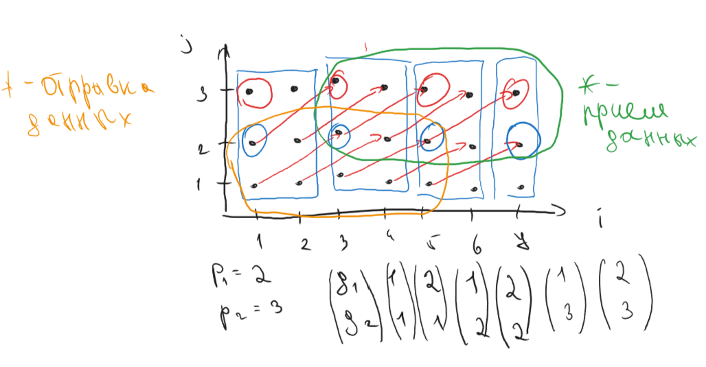

Как в прошлом случае количество задач найденных таким образом много больше числа используемых устройств, поэтому задачи объединяют.

# ВЕКТОРНЫЕ АЛГОРИТМЫ

## 13. !Основные операции с векторами и матрицами. Векторные алгоритмы умножения матриц.!

Пункт 3.1.1 Основные векторные операции

**Операция с вектором (аппаратно)**

1. $z = x+y$, где $z,x,y \in R^{n \times 1}$ - сложение

2. $z = \alpha x$, где $\alpha \in R$ - умножение вектора на скаляр

3. $z = x^Ty$ - скалярное произведение

4. $z = x * y$ - покомпонентное произведение

5. $z = \alpha x + y$ - saxpy (scalar $\alpha$ $x$ plus $y$)

**Операции с матрицами**

1. $z = Ax + y$, где $A \in R^{n \times m}$ $z,y \in R^{n \times 1}$ $x\in R^{m \times 1}$ - gaxpy (ganed $A$ $x$ plus $y$)

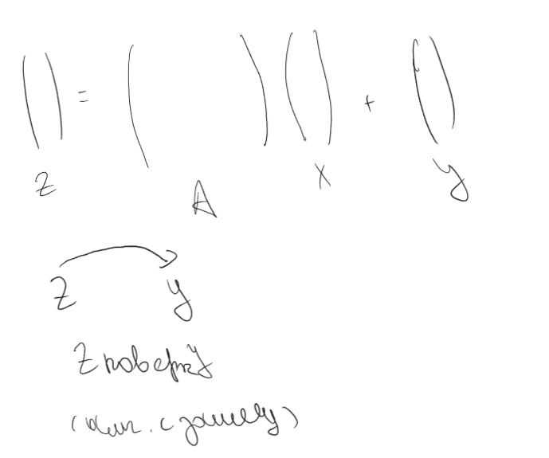

**gaxpy через скалярное произведение**

```text
for i = 1:n
	y(i) = A(i,:)x+y(i)
endfor
```

**План Б. Выражение gaxpy через saxpy**

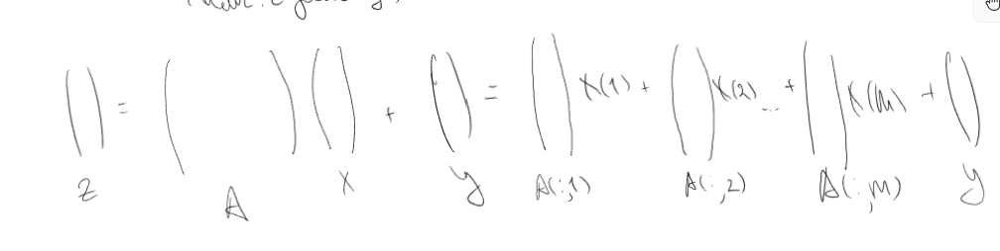

```text
for j = 1:m
	y = y + A(:,j)x(j)
endfor
```

2. $A = A + xy^T$, где $A \in R^{n \times m}$ $x \in R^{n \times 1}$ $y \in R^{m \times 1}$

Вся операция вместе - называется модификация матрицы внешним произведением

```text
for i=1:n
	A(i,:) = A(i,:) + x(i)y^T - строчное saxpy
endfor

for j=1:m
	A(:,j) = A(:,j) + xy(j) - столбцовое saxpy
endfor
```

Пункт 3.1.2 Векторные алгоритмы умножения матриц

**Умножение по определению**:

```text
for i=1:n
	for j=1:n
		for k=1:n
			c(i,j) = A(i,k)B(k,j)
		endfor
	endfor
endfor
```

**Цикл k преобразуем в скалярное произведение:**

```text
for i=1:n
	for j=1:n
		c(i,j) = A(i,:)B(:,j)
	endfor
endfor
```

**Цикл j убираем, получаем gaxpy:**

```text
for i=1:n
	c(i,:) = A(i,:)B - строчное gaxpy
endfor
```

$z = xA + y$, где $A \in R^{n \times m}$ $x \in R^{n \times 1}$ $y \in R^{m \times 1}$ - строчное gaxpy

| Название алгоритма | Векторная операция     | Название операции   | $c=A*B$ Доступ к памяти |
| ------------------ | ---------------------- | ------------------- | ----------------------- |
| $ijk$              | скалярное произведение | строчное gaxpy      | смешанная               |
| $kij$              | строчное saxpy         | модификация матрицы | по строкам              |

```text
for k=1:n
	for i=1:n
		for j=1:n
			c(i,j) = c(i,j) + A(i,k)B(k,j)
		endfor
	endfor
endfor
```

**Свернем j цикл (saxpy строчное):**

```text
for k=1:n
	for i=1:n
		c(i,:) = c(i,:) + A(i,k)B(k,:) - saxpy строчное
	endfor
endfor
```

**Свернем i цикл (модификация матрицы):**

```text
for k=1:n
	c = c + A(:,k)B(k,:) - модификация матрицы
endfor
```

**Блочный алгоритм:**

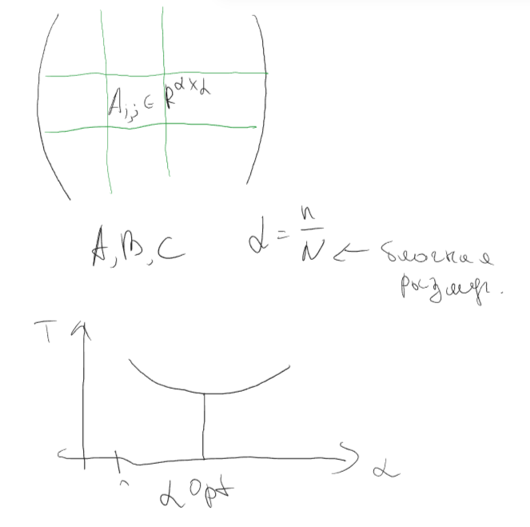

```text
for i_b = 1:N
	i=1(i_b-1)alpha + 1 : i_b alpha
	for j_b = 1:N
		j=1(j_b-1)alpha + 1 : j_b alpha
		for k_b = 1:N
			k=1(k_b-1)alpha + 1 : k_b alpha
			c(i,j) = c(i,j) + A(i,k)B(k,j)
		endfor
	endfor
endfor		
```

## 14. !Векторные алгоритмы решения СЛАУ с матрицей треугольного вида.!

Пункт 3.2.1 Решение СЛАУ c матрицами треугольного вида

$Lx=b$

$$\begin{pmatrix}  
l_{11} & 0 & 0 & \cdots & 0 \\  
l_{21} & l_{22} & 0 & \cdots & 0 \\  
l_{31} & l_{32} & l_{33} & \cdots & 0 \\  
\vdots & \vdots & \vdots & \ddots & \vdots \\  
l_{n1} & l_{n2} & l_{n3} & \cdots & l_{nn}  
\end{pmatrix}
\begin{pmatrix}
x_{1} \\
x_{2} \\
x_{3} \\
\dots \\
x_{n}
\end{pmatrix}
=
\begin{pmatrix}
b_{1} \\
b_{2} \\
b_{3} \\
\dots \\
b_{n}
\end{pmatrix}$$ 

$$
x_{1} = \frac{b_{1}}{l_{11}}
$$

$$
x_{2} = \frac{b_{2} - l_{21}x_{1}}{l_{22}}
$$

$$
x_{3} = \frac{b_{3}-l_{31}x_{1}-l_{32}{x_{2}}}{l_{33}}
$$

$$
x_{i} = \left( b_{i} - \sum_{j=1}^{i-1}\frac{l_{ij}x_{j}}{l_{ii}} \right)
$$

$L(i,1:i-1)b(1:i-1)$ - скалярное произведение

```text
for i=2:n
	b(i) = b(i) - L(i,1:i-1)b(1:i-1) / L(i,i)
endfor
```

Пусть L нижняя унитреугольная матриц

```text
for i=2:n
	b(i) = b(i) - L(i,1:i-1)b(1:i-1) - стркоа
endfor
```

$$
\begin{pmatrix}  
l_{11} & 0 & 0 & \cdots & 0 \\  
l_{21} & l_{22} & 0 & \cdots & 0 \\  
l_{31} & l_{32} & l_{33} & \cdots & 0 \\  
\vdots & \vdots & \vdots & \ddots & \vdots \\  
l_{n1} & l_{n2} & l_{n3} & \cdots & l_{nn}  
\end{pmatrix}
\begin{pmatrix}
x_{1} \\
x_{2} \\
x_{3} \\
\dots \\
x_{n}
\end{pmatrix}
=
\begin{pmatrix}
b_{1} \\
b_{2} \\
b_{3} \\
\dots \\
b_{n}
\end{pmatrix}
-
\begin{pmatrix}
l_{21} \\
l_{31} \\
l_{41} \\
\dots \\
l_{n1}
\end{pmatrix} \text{ - b'}
$$

$$
x_{1} = \frac{b_{1}}{l_{11}}
$$

$$
x_{2} = \frac{b'_{2}}{l_{22}}
$$

```text
for j=1:n-1
	b(j) = b(j)/L(j,j)
	b(j+1:n) = b(j+1:n) - L(j+1:n,j)b(j) - saxpy (столбец)
endfor
b(n)=b(n)/L(n,n)
```

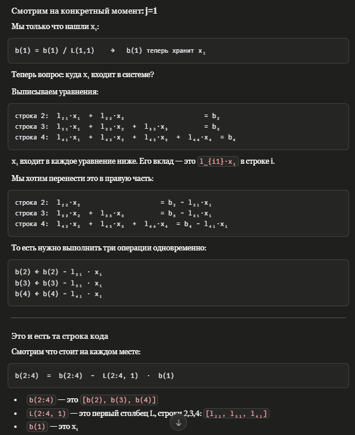

Пусть L нижняя унитреугольная матриц

```text
for j=1:n-1
	b(j+1:n) = b(j+1:n) - L(j+1:n,j)b(j) - saxpy (столбец)
endfor
```

$L=X=B$, где $L \in R^{n \times n}$ $X,B \in R^{n \times m}$

$\frac{n}{N} = \alpha$

$L_{i_{b},j_{b}} \in R^{\alpha \times \alpha}$

$B_{i_{b}},X_{i_{b}} \in R^{\alpha \times m}$

$1 \leq i_{b},j_{b}$

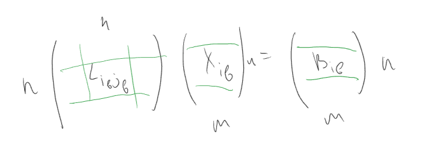

```text
for j_b = 1:N
	#решаем L_{j_b,j_b}X_{j_b} = B_{j_b} - СЛАУ
	for i_b = j_b+1:N
		B_{i_b} = B_{i_b} - L_{i_b,j_b}X_{i_b}
	endfor
endfor
L_{N,N}X_{N}=B_{N}
```

## 15. Векторные алгоритмы LU-разложения через модификацию матрицы внешним произведением.

Пункт 3.2.2 Алгоритм LU разложения через модификацию внешним произведением

$$
\begin{pmatrix}
1 & 0 \\
-\frac{x_{2}}{x_{1}} & 1
\end{pmatrix}
\begin{pmatrix} x_{1} \\ x_{2}\end{pmatrix} = \begin{pmatrix}x_{1} \\ 0\end{pmatrix}
$$

$$
\begin{pmatrix}
1 & 0 \\
-\frac{x_{2}}{x_{1}} & 1
\end{pmatrix} - \text{матрица Гаусса}
$$

$$
\begin{pmatrix}
1 & 0 & \cdots & 0 & 0 & \cdots & 0 \\
0 & 1 & \cdots & 0 & 0 & \cdots & 0 \\
\vdots & \vdots & \ddots & \vdots & \vdots & & \vdots \\
0 & 0 & \cdots & 1 & 0 & \cdots & 0 \\[4pt]
0 & 0 & \cdots & -\frac{x_{k+1}}{x_k} & 1 & \cdots & 0 \\
\vdots & \vdots & & \vdots & \vdots & \ddots & \vdots \\
0 & 0 & \cdots & -\frac{x_n}{x_k} & 0 & \cdots & 1
\end{pmatrix}
\begin{pmatrix}
x_{1} \\
x_{2} \\
\dots \\
x_{k} \\
x_{k+1} \\
\dots \\
x_{n}
\end{pmatrix}
=
\begin{pmatrix}
x_{1} \\
x_{2} \\
\dots \\
x_{k} \\
0 \\
\cdots \\
0
\end{pmatrix}
$$

$$
\tau^{(k)} =
\begin{pmatrix}
0 \\
0 \\
\vdots \\
0 \\
\frac{x_{k+1}}{x_{k}} \\
\vdots \\
\frac{x_{n}}{x_{k}} \\
\end{pmatrix}
$$


$$ \tau^{(k)}_{i} = \left\{ \begin{array}{ll} 0 \text{ , при i <=k}\\ \frac{x_{i}}{x_{k}} \text{ , при i > k} \end{array}\right. $$

$$
l_{k} = 
\begin{pmatrix}
0 \\
\vdots \\
1 \\
\vdots \\
0
\end{pmatrix}
$$

$$
\tau^{(k)} l_{k}^T = ???
$$


$$
\tau^{(k)}_{i} = \frac{a_{ik}}{a_{kk}}
$$

$$
I-\tau^{(k)}l_{k}^T \text{- это Mk матрица преобразования Гаусса}
$$

$$
MkA = (I-\tau^{(k)}l_{k}^T)A = A - \tau^{(k)}l_{k}^TA = A - \tau^{(k)}A(k,:)
$$


$c = IAB$, где $A - \text{I на N}$, $B -\text{N на J}$, $C - \text{I на J}$


$M_{n-1}\dots M_{2}M_{1}A = U$

$M_{n-2}\dots M_{1}A=M_{n-1}^{-1}U$

$A = M_{1}^{-1}M_{2}^{-1}\dots M_{n-1}^{-1}U$

$L = \prod_{k=1}^{n-1}M_{k}^{-1} = I + \sum_{k=1}^{n-1}\tau^{(k)}l_{k}^T$


**Алгоритм LU разложения:**

```text
for k 1:n-1
	A(k+1:n,k) = A(k+1:n,k) / A(k,k) - k-ый вектор множителя гаусса (k-ый столбец матрицы l)
	A(k+1:n,k+1:n) = A(k+1:n,k+1:n) - A(k+1:n,k)A(k,k+1:n)
endfor
```

На $k$-ом шаге алгоритма находи $k+1$-ый столбец:


|             | Название | Вектор                 | Матричный операции                        | Доступ к данным |
| ----------- | -------- | ---------------------- | ----------------------------------------- | --------------- |
| C<br>       | kji      | Столбцовый saxpy       | Модификация матрицы внешним произведением | Столбцовый      |
| C           | kij      | Строчный saxpy         | Модификация матрицы внешним произведением | Строчный        |
| Fortran<br> | jik      | Скалярное произведение | Столбцовое gaxpy                          | Смешанное       |
| Fortran     | jki      | Столбцовое saxpy       | Столбцовое gaxpy                          | Столбцовый      |

**При возможности реализовать одно и тоже через модификацию матрицы или gaxpy предпочтение отдают gaxpy, потому что по сравнению с модификацией матрицей gaxpy характеризуется вдвое меньшим объемом коммуникаций между кэш памятью процессора и регистрами**

## 16. Векторные алгоритмы LU-разложения через gaxpy.

Пункт 3.2.3 Производственное LU разложение через gaxpy

$$A = LU$$

Положим что к $j$-ому шагу алгоритма первые $j-1$ столбцов $L$ и $U$ уже найдены, найдем $j$

$A(:,j) = LU(:,j)$

1) $A(1:j-1,j) = L(1:j-1,:)U(:,j)$


$A(1:j-1,j)= L(1:j-1,1:j-1)U(1:j-1,j)$, получаем:

$L(1:j-1,1:j-1)$ - знаем

$U(1:j-1,j)$ - ищем

Это СЛАУ $Lx=b$, где $b$ - $A(1:j-1,j)$, $x$ - $U(1:j-1,j)$

2) $A(j:n,j) = L(j:n,:)U(:,j)$


$A(j:n,j) = L(j:n,1:j)U(1:j,j)$

$A(j:n,j) = \sum_{k=1}^jL(j:n,k)U(k,j)$

$A(j:n,j) = \sum_{k=1}^{j-1}L(j:n,k)U(k,j) + L(j:n,j)U(j,j)$

$A(j:n,j) = L(j:n,1:j-1)U(1:j-1,j) + L(j:n,j)U(j,j)$, получаем:

$A(j:n,j)$ - знаем

$L(j:n,1:j-1)$ - знаем

$U(1:j-1,j)$ - знаем

$L(j:n,j)$ - неизвестно $V(j:n)$

$V(j:n) = A(j:n,j) - L(j:n,1:j-1)U(1:j-1,j)$ - gaxpy

$V(j:n) = L(j:n,1:j-1)U(j,j)$


$L(j+1:n,j) = V(j+1:n)U(j,j)$

```text
for j=1:n
	1) решаем СЛАУ L(1:j-1,1:j-1)U(1:j-1,j) = A(1:j-1,j)
	2) gaxpy V(j:N) = A(j:n,j) - L(j:n,j-1)U(1:j-1,j)
	U(j,j) = V(j)
	L(j+1:n,j) = V(j+1:n)U(j,j)   
endfor
```

```text
for j=1:n
	for k=1:j-2
		A(k+1:j-1,k) = A(k+1:j-1,k) - A(k+1:j-1,k)A(k,j)
	endfor
	A(j:n,j) = A(j:n,j) - A(j:n,1:j-1)A(1:j-1,j) => вниз смотри 1),2)
	A(j+1:n,j) = A(j+1:n,j)A(j,j)
endfor
```

1)
```text
for k=1:j-1
	A(j:n,j) = A(j:n,j)-A(j:n,k)A(k,j)
endfor
```

2)
```text
for i=j:n
	A(i,j)=A(i,j) - A(i,1:j-1)A(1:j-1,j) - скалярное произведение
endfor
```

## 17.Векторные алгоритмы разложения Холецкого через модификацию матрицы внешним произведением.

$A = LU$

$A = L \cdot L^T$

$A = G \cdot G^T$

Пункт 3.3.1 Разложение Холецкого через модификацию матрицы внешним произведением

Пусть $r=1$

$$
A=
\begin{pmatrix}
\alpha & v^T\\
v & B
\end{pmatrix}
=
$$

$$
=
\begin{pmatrix}
\beta & \text{нули} \\
\frac{v}{\beta} & I_{n-1} \\
\end{pmatrix}
\begin{pmatrix}
1 & \text{нули} \\
\text{нули} & B- \frac{v \cdot v^T}{\alpha}
\end{pmatrix}
\begin{pmatrix}
\beta & \frac{v^T}{\beta} \\
\frac{v}{\beta} & I_{n-1} \\
\end{pmatrix}
$$

$\alpha \in \mathbb{R}$

$\alpha = a_{11}$; $\beta=\sqrt{ \alpha }$

$v = A(2:n,1)$

$v \in \mathbb{R}^{(n-1) \times 1}$


$B = A(2:n,2:n)$

$B \in \mathbb{R}^{(n-1) \times (n-1)}$

$$B- \frac{v \cdot v^T}{\alpha} - \text{модификация матрицы внешним произведением}$$

$$
B- \frac{v \cdot v^T}{\alpha} = G_{1} \cdot G_{1}^T =
\begin{pmatrix} \beta & \text{нули} \\ \frac{v}{\beta} & G_{1}\end{pmatrix}
\begin{pmatrix} \beta & \frac{v^T}{\beta} \\ \text{нули} & G_{1}^T\end{pmatrix}
$$

$G_{1} \in \mathbb{R}^{(n-1) \times (n-1)}$

$G = \begin{pmatrix} \beta & \text{нули} \\ \frac{v}{\beta} & G_{1}\end{pmatrix}$

**Матричный вид:**

```text
for k=1:n
	A(k:n,k) = A(k:n,k)(sqrt(A(k,k)))
	A(k+1:n,k+1:n) = A(k+1:n,k+1:n) - A(k+1:n,k)[A(k+1:n,k)]^T
endfor 
```

**Векторный вид:**

```text
for k=1:n
	A(k:n,k) = A(k:n,k)/sqrt(A(k,k))
	for j=k+1:n
		A(j:n,j) = A(j:n,j) - A(j:n,k)A(j,k) 
	endfor
endfor 
```

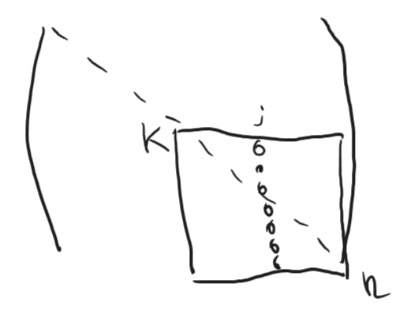

**Таблица для Холецкого:**

| Название алгоритма | Векторная операция | Матричная операция                        | Доступ к памяти |
| ------------------ | ------------------ | ----------------------------------------- | --------------- |
| kji                | столбцовый saxpy   | модификацию матрицы внешним произведением | по столбцам     |
| kij                | строчный saxpy     | модификацию матрицы внешним произведением | по строчкам     |

## 18. Векторные алгоритмы разложения Холецкого через gaxpy.

Пункт 3.3.2 Разложение Холецкого через gaxpy

Пусть к $j\text{-ому}$ шагу алгоритма первые $j-1\text{-ый}$ столбцов матрицы $J$ найдены, отыщем $j\text{-ий}$.


$A=G * G^T$
$A(:,j) = G * G^T(:,j)$

1) $A(1:j-1,j) = G(1:j-1,:)G^T(:,j)$

$A(1:j-1,j) = G(1:j-1,1:j-1)G^T(1:j-1:,j)$

2) $A(j:n,j) = G(j:n,j)G^T(:,j)$

$A(j:n,j) = G(j:n,1:j)G^T(1:j,j)$

$A(j:n,j) = \sum_{k=1}^JG(j:n,k)G^T(k,j)$

$A(j:n,j) = \sum_{k=1}^{j-1}G(j:n,k)G^T(k,j) + G(j:n,j)G^T(j,:)$

$A(j:n,j) = G(j:n,1:j-1)G^T(1:j-1,j) + G(j:n,j)G^T(j,j)$

$G(j:n,j)G^T(j,j) \quad (\text{не знаем, назовём - } V(j:n))$

$V(j:n) = A(j:n,j) - G(j:n,1:j-1)G^T(1:j-1,j)$

$V(j:n) = G(j:n,j)G^T(j,j)$

$V(j:n) = G(j,j)G(j,j)$

$G(j,j)= \sqrt{V(j)}$

$G(j+1:n,j) = V(j+1:n)G(j,j)$

**Алгоритм:**

```text
for j=1:n
	A(j:n,j) = A(j:n,j) - A(j:n,1:j-1) * [A(j,1:j-1)]^T #столбцовый gaxpy
	#V(j,n)    #A(j:n,j)  #G(j:n,1:j-1)  #G^T(1:j-1,j)
	
	A(j:n,j) = A(j:n,j) / sqrt(A(j,j))
endfor
```

преобразуем операцию gaxpy через скалярное произведение (Алгоритм jik) $\implies$:

```text
for i=j:n
	A(i,j) = A(i,j) - A(i,1:j-1) * [A(j,1:j-1)]^T
endfor
```

преобразуем операцию gaxpy через столбцовое saxpy (Алгоритм jki) $\implies$:

```text
for k=1:j-1
	A(j:n,j) = A(j:n,j) - A(j:n,k) A(j,k)
endfor
```

|           | Название алгоритма | Векторная операция     | Матричная операция | Доступ к памяти |
| --------- | ------------------ | ---------------------- | ------------------ | --------------- |
| С         | jik                | Скалярное произведение | Столбцовое gaxpy   | Строчный        |
| С/Fortran | jki                | Столбцовое saxpy       | Столбцовое gaxpy   | Столбцовый      |

# ПАРАЛЛЕЛЬНЫЕ АЛГОРИТМЫ

## 19. Рассылка данных по бинарному дереву.

**Бинарное дерево**

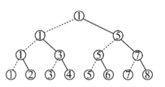

**Звезда**

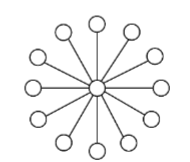

**В сетевой конфигурации звезда  выделяется центральный процессор (manager), связанный с каждым из периферийных (workers). Её недостатком признается необходимость маршрутизации через единственный узел.** 

**Поэтому в задачах, связанных с рассылкой или сбором данных, уместней использование конфигурации бинарное дерево, на которой принято реализовывать следующую стратегию «разделяй и властвуй».** 

**Положим, что необходимо разослать некоторое сообщение от одного процессора остальным; всего процессоров 8. Тогда на конфигурации звезда и бинарное дерево это займет по 7 коммуникаций, однако в последнем случае часть коммуникаций можно произвести одновременно.** 

Действительно, на первом шаге процессор 1 отправляет сообщение процессору 5, на втором шаге одновременно 1 отправляет 3, а 5 – 7. Завершают рассылку коммуникации между нечетными (отправляют) и четными (принимают) процессорами. Последовательно производится лишь 3 коммуникации. **В общем случае вместо p – 1 коммуникации на звезде получаем $lop_{2}p$ на бинарном дереве, где p – число процессоров.**

Рассматривая пример бинарного дерева на рисунке для p=8, выделим на нем четыре уровня, нумеруя их сверху вниз 3, 2, 1, 0 в порядке убывания. 

На третьем (верхнем) расположена задача 1, которой предстоит начать вычисления, отправив задаче 5 правую половину вектора a(n/2+1:n).

На втором уровне задача 1 отправляет задаче 3 вторую четверть вектора a(n/4+1:n/2), задача 5 принимает вторую половину a от задачи 1 и отправляет последнюю четверть a(3/4·n+1:n) задаче 7. 

Действия на первом уровне характеризуются отправкой задачей 1 второй восьмушки вектора a(n/8+1:n/4) задаче 2; задачи 3 и 7 принимают от 1 и 5 вектора a(n/4+1:n/2) и a(3/4·n+1:n) соответственно; затем задачи 3, 5 и 7 отправляют зада- чам 4, 6 и 8 вектора a(3/8·n+1:n/2), a(5/8·n+1:3/4·n) и a(7/8·n+1:n). 

На нижнем уровне задачи с четными номерами принимают отправленные им ранее данные. 

**Теперь необходимо сформулировать это в виде алгоритма, не ограничиваясь случаем восьми задач. Осмыслив проблему в целом, разделим задачи искомого алгоритма на три множества: первая задача (несколько раз отправляет данные), четные задачи (один раз принимают) и все остальные (один раз принимают, несколько раз отправляют).** Сформулировав инструкции для первой и четных задач можно объединить их и предписать получившиеся действия остальным задачам. В итоге получится Алгоритм 1.2. 

**Первой задаче предписывается исполнение инструкций в строках 02-06, где она в цикле по i, спускаясь по уровням дерева, рассылает вторую половину оставшегося у нее вектора a (вектор на каждой итерации сокращается вдвое с отсечением конца) задаче $1+2^{i-1}$. Все четные задачи исполняют инструкцию 09, принимая известное количество элементов вектора у задачи с номером на единицу меньшем.**

```text
# инициализация 
a(1:n) – рассылаемый вектор,
n – его размер,
μ – номер задачи, 
p – общее количество задач, 
r = n/p, топология ком- муникаций – бинарное дерево 
01 if μ=1 then # действия первой задачи 
	02 k=log2p; # верхний уровень дерева 
	03 for i=k:-1:1 # организация коммуникаций 
		04 send(a(n/2+1:n), 1+2^{i-1} ); # отправка данных 
		05 n=n/2; # сокращение длины вектора 
	06 endfor 
07 else 
	08 if μ - четное then # действия четных задач 
		09 recv(a(1:r), μ-1); # прием данных 
	10 else # действия оставшихся задач 
		11 # поиск уровня k, с которого начинается рассылка 
		12 k=0; q=μ; 
		13 while mod(q,2)≠0 
			14 q=(q+1)/2; k=k+1; 
		15 endwhile 
		16 n=n/2^{log2p}-k; # размер принимаемых данных 
		17 recv(a(1:n), μ-2k); # прием данных 
		18 for i=k:-1:1 # организация коммуникаций 
			19 send(a(n/2+1:n), μ+2^{i-1} ); # отправка данных 
			20 n=n/2; # сокращение длины вектора 
		21 endfor 
	22 endif 
23 endif 
```

**Нечетные, за исключением первой, сначала в 11–15 по знакомой из теории графов процедуре вычисляют уровень дерева k, на котором необходимо произвести прием. Затем определяют в зависимости от этого уровня количество принимаемых данных (строка 16) и производят прием (17) от задачи $μ-2^k$ – фрагмент, аналогичный действиям четных задач. Завершается алгоритм рассылкой этих данных по дереву (18-21), как в первой задаче.**

## 20. Параллельная реализация рекуррентных выражений.

Циклические конструкции широко применяются для организации вычислений по рекуррентным выражениям. 

**Рассмотрим на примере рекуррентного выражения $x_i=a_i \cdot x_{i-1}$ ($1 \leq i \leq n$) при необходимости отыскать $x_n$. На пространстве итераций $I=\{(i): 1 \leq i \leq n\}$ каждый вектор зависит от всех предыдущих (пространство упорядочено отношением следования) и нет никаких двух независимых друг от друга векторов. Методы автоматического распараллеливания не подходят для данной задачи. И все же такой алгоритм очевиден.**

**Представим рассматриваемое рекуррентное выражение в «развернутом» виде** $$x_n = a_n \cdot a_{n-1} \cdot a_{n-2} \cdot \ldots \cdot a_3 \cdot a_2 \cdot a_1 \cdot x_0$$ **и поставим в соответствие задаче $\mu$ ($1 \leq \mu \leq n/2$) параллельного алгоритма операцию $a_{2\mu} \cdot a_{2\mu-1}$. Все $n/2$ таких операций на первом шаге параллельного алгоритма могут быть произведены одновременно — параллельно. Далее возможно одновременное исполнение $n/4$, $n/8$, ..., 2 умножений — всего за $\log_2(n)-1$ шагов параллельного алгоритма. На завершающем шаге результат домножается на $x_0$.** 

**Ускорение вычислений по такому алгоритму оцениваем величиной $n/\log_2(n)$.** 

Приведенный пример с одной стороны иллюстрирует превосходство живого человеческого воображения над шаблонным подходом, с другой стороны указывает на необходимость формализации процедуры распараллеливания вычислений по рекуррентным выражениям.

Будем двигаться в сторону усложнения рекуррентного выражения. 

**Рассмотрим случай $x_i = a_i \cdot x_{i-1} + b_i$ ($1 \leq i \leq n$) при необходимости отыскать $x_n$.** Применить для его параллельного вычисления прием, аналогичный предыдущему, удастся после представления рассматриваемого выражения в форме без последнего слагаемого. Для этого перейдем к матричной нотации. 

**Пусть вектор $\mathbf{x}_i = \begin{pmatrix} x_i \\ 1 \end{pmatrix}$ и матрица $A_i = \begin{pmatrix} a_i & b_i \\ 0 & 1 \end{pmatrix}$. Тогда рекуррентное выражение запишется в виде $\mathbf{x}_i = A_i \mathbf{x}_{i-1}$. И $\mathbf{x}_n = A_n \cdot A_{n-1} \cdot A_{n-2} \cdot \ldots \cdot A_3 \cdot A_2 \cdot A_1 \cdot \mathbf{x}_0$ после «развертывания». Умножение матриц можно провести параллельно по ранее представленной процедуре.** 

Структура матрицы, характеризующейся второй строчкой (0 1), при умножении воспроизводится, следовательно лишних арифметических операций не будет.

**При работе с выражением $x_i = a_i \cdot x_{i-1} + b_i \cdot x_{i-2}$ уместно представить вектор $\mathbf{x}_i = \begin{pmatrix} x_i \\ x_{i-1} \end{pmatrix}$ и матрицу $A_i = \begin{pmatrix} a_i & b_i \\ 1 & 0 \end{pmatrix}$.** 
**Тогда рекуррентное выражение по-прежнему запишется в виде $\mathbf{x}_i = A_i \mathbf{x}_{i-1}$.** 

**Далее, для рекуррентного выражения $x_i = a_i \cdot x_{i-1} + b_i \cdot x_{i-2} + c_i$ размерность вектора и матрицы повысится:** **$$\mathbf{x}_i = \begin{pmatrix} x_i \\ x_{i-1} \\ 1 \end{pmatrix}, \quad A_i = \begin{pmatrix} a_i & b_i & c_i \\ 1 & 0 & 0 \\ 0 & 0 & 1 \end{pmatrix}$$ В общем случае, для выражения $x_i = a_i \cdot x_{i-1} + b_i \cdot x_{i-2} + \ldots + c_i \cdot x_{i-k+1} + d_i \cdot x_{i-k} + e_i$ записывают:** $$\mathbf{x}_i = \begin{pmatrix} x_i \\ x_{i-1} \\ \ldots \\ x_{i-k+1} \\ x_{i-k} \\ 1 \end{pmatrix}, \quad A_i = \begin{pmatrix} a_i & b_i & \ldots & c_i & d_i & e_i \\ 1 & 0 & \ldots & 0 & 0 & 0 \\ \ldots & \ldots & \ldots & \ldots & \ldots & \ldots \\ 0 & 0 & \ldots & 0 & 0 & 0 \\ 0 & 0 & 0 & 1 & 0 & 0 \\ 0 & 0 & \ldots & 0 & 0 & 1 \end{pmatrix}$$

## 21. !Систолический алгоритм gaxpy на процессорном кольце с декомпозицией матрицы на блочные строки.!

Систолические алгоритмы характеризуются следующей структурой:

```text
for t=1:T #глобальный
	send(...);
	recv(...);
	арифетические операции
end
```

**Операцию gaxpy (general A x plus y.) принято записывать в виде:**

$А \in R^{n \times n}$

$x,y,z \in R^{n \times 1}$

$1 \leq \mu \leq p$

$z = Ax + y$

**Положим, что вектора и матрица из gaxpy для удобства составления параллельного алгоритма разбиты на блоки:**

$x_{i},y_{i},z_{i} \in R^{\alpha \times 1}$

$1\leq i\leq p$

$\alpha = \frac{n}{p}$

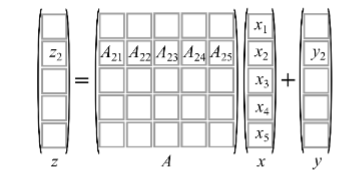

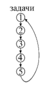

**Тогда выделяя из строки и x отдельные блоки перепишем последнее выражение через блочное скалярное произведение блочной строки A и вектора x:**

$z_{\mu} = A_{\mu} x + y_{\mu} = \sum_{k=1}^{p} A_{\mu k} x_k + y_{\mu}$

Необходимости в обмене данными между задачами при таком их распределении не возникает; платой за отсутствие коммуникаций является дублирование вектора x в памяти всех задач.

**Алгоритм 1** Параллельный алгоритм gaxpy без коммуникаций с распределением матрицы по блочным строкам:

```text
# инициализация
row = (mu-1)*alpha+1:mu*alpha
A_loc = A(row,:)
y_loc = y(row) 
x_loc = x
for k = 1:p
    a = (k-1)*alpha+1:k*alpha
    y_loc =y_loc+A_loc(:,a)*x_loc(a)
endfor
```

Переходя к построению следующего алгоритма откажемся от дублирования вектора x в памяти всех задач. Пусть при начальном распределении данных задаче $\mu$ достанется блок $x_{\mu}$. Тогда необходимо предусмотреть обмен блоками этого вектора между задачами алгоритма; такой, чтобы в памяти любой задачи побывали все блоки x, как необходимые для вычислений.

**Алгоритм 2** Параллельный алгоритм gaxpy на кольце с распределением матрицы по блочным строкам:

```text
# инициализация: 
row = (mu-1)*alpha+1:mu*alpha
A_loc = A(row,:)
y_loc = y(row)
x_loc = x(row)
left, right
for k = 1:p
    send(x_loc, right)
    recv(x_loc, left)
    tau = mu - k;  
    if tau ≤ 0 then
	    tau=tau+p
        a = (tau-1)*alpha+1:tau*alpha
    endif
    y_loc = y_loc+A_loc(:,a)*x_loc
endfor
```


**!!!Перефразированный текст из методички нейронкой!!!**

В новом варианте инициализации каждая задача $\mu$ хранит только один блок вектора $x$:
$$
x_\mu = x((\mu-1)\beta+1:\mu\beta).
$$

Переменные `left` и `right` задают соседние задачи в процессорном кольце:
$$
left=\mu-1,\qquad right=\mu+1,
$$
при этом для первой задачи левым соседом является задача $p$, а для последней правым — задача $1$.

На каждой итерации задача отправляет текущий блок $x_{loc}$ правому соседу (`send`) и получает новый блок от левого соседа (`recv`). За $p$ итераций через каждую задачу проходят все блоки вектора $x$.

Индекс полученного блока определяется как $\tau$. Если $\tau \le 0$, то:
$$
\tau = \tau + p,
$$
что учитывает циклический переход между задачами $p$ и $1$.

В зависимости от $\tau$ выбирается соответствующий блок матрицы:
$$
A_{\mu\tau},
$$
и вычисляется часть суммы:
$$
y_\mu = \sum_{\tau=1}^{p} A_{\mu\tau}x_\tau.
$$

В отличие от Алгоритма 1, где все задачи одновременно использовали один и тот же блок $x$, в Алгоритме 2 на каждой итерации используются разные блоки. Например, на первой итерации выполняются:
$$
A_{1p}x_p,\quad A_{21}x_1,\quad \dots,\quad A_{p,p-1}x_{p-1},
$$
а на последней:
$$
A_{11}x_1,\quad A_{22}x_2,\quad \dots,\quad A_{pp}x_p.
$$

Таким образом, вычисления организуются как циклический обмен блоками вектора $x$ между задачами без их дублирования в памяти.

## 22. !Систолический алгоритм gaxpy на процессорном кольце с декомпозицией матрицы на блочные стролбцы.!

Систолические алгоритмы характеризуются следующей структурой:

```text
for t=1:T #глобальный
	send(...);
	recv(...);
	арифетические операции
end
```


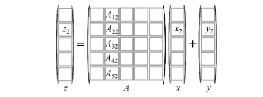

Линейная комбинации блочных столбцов матрицы $A$:
$$
z=\sum_{j=1}^{p}A_jx_j+y,
$$
где блочный столбец
$$
A_j\in\mathbb{R}^{n\times\beta}, \qquad 1\le j\le p.
$$

Необходимо распределить вычисления данной операции между $p$ задачами параллельного алгоритма с учетом коммуникаций.

Предполагается, что каждая задача $\mu$ вычисляет блок
$$
z_\mu.
$$

Тогда при
$$
\omega_j=A_jx_j
$$
выражение для $z_\mu$ принимает вид:
$$
z_\mu=\sum_{j=1}^{p}\omega_j(row)+y_\mu.
$$

Здесь
$$
\omega_j\in\mathbb{R}^{n\times1},
$$
$$
row=(\mu-1)\alpha+1:\mu\alpha.
$$

**Алгоритм 3:**
```text
# инициализация
col=(μ-1)α+1:μα;
Aloc=A(:,col);
xloc=x(col);
yloc=y(col);
left, right

w=Aloc xloc

for j=1:p
    send(w,right)
    recv(w,left)
    yloc=yloc+w(col)
end for
```

**!!!Перефразированный текст из методички нейронкой!!!**

После инициализации каждая задача $\mu$ содержит блочный столбец $A_\mu$
и соответствующий блок вектора $x_\mu.$

Поэтому сначала выполняется локальное умножение:
$$
\omega_\mu=A_\mu x_\mu.
$$

Полученный вектор
$$
\omega_\mu
$$
затем передается по процессорному кольцу. За время выполнения цикла через каждую задачу проходят все векторы
$$
\omega_j
$$
из выражения
$$
z_\mu=\sum_{j=1}^{p}\omega_j(row)+y_\mu.
$$

На каждой итерации, помимо коммуникации, выполняется одно сложение:
$$
y_{loc}=y_{loc}+\omega(row).
$$

Как и в Алгоритме 2, порядок сложения в разных задачах различается, однако это не влияет на результат благодаря коммутативности сложения векторов.

В отличие от Алгоритма 2, здесь не требуется учитывать номер задачи, сформировавшей принятый вектор $\omega$. Все полученные векторы обрабатываются одинаково, что существенно упрощает алгоритм.

Недостатком такого подхода является увеличение объема передаваемых данных. Вместо блоков
$$
x_{loc}\in\mathbb{R}^{\beta}
$$
по кольцу пересылаются полные векторы
$$
\omega\in\mathbb{R}^{n},
$$
из-за чего объем коммуникаций возрастает в
$$
\frac{n}{\beta}
$$
раз.

## 23. !Столбцово-ориентированные алгоритмы умножения матриц на кольце.!

Далее будем говорить о производстве операции

$$
D = C + AB,
$$

где

$A, B, C, D \in R^{\alpha \times \alpha}$

$A_{ij}, B_{ij}, D_{ij}, C_{ij} \in R^{n \times n}$

$1 \le i,j \le p, \qquad \alpha = n/p, \quad$

Задача $\mu$:

$$
D_{\mu} = C_{\mu} + AB_{\mu}
       = C_{\mu} + \sum_{j=1}^{p} A_j B_{j\mu}.
$$

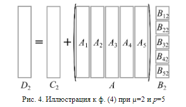


В Алгоритме матрица A распределяется по блочным столбцам, а вычисления по формуле выше сопровождаются пересылками упомянутых столбцов между задачами. Для организации таких пересылок используются каналы, соответствующие топологии процессорное кольцо.

```text
# Инициализация
col  = (mu - 1)alpha + 1:mu*alpha;
Aloc = A(:, col);
Bloc = B(:, col);
Cloc = C(:, col);
left, right

for j = 1:p 
    send(Aloc, right)
    recv(Aloc, left)
    # определение индекса полученного блока A_tau
    tau = mu - j;
    if tau <= 0 then
        tau = tau + p;
    end if
    a = (tau - 1)*alpha + 1:tau*alpha;
    # индексы, задающие блочный столбец tau матр. A
	Cloc = Cloc + Aloc * Bloc(a, :);
endfor
```

## 24. !Строчно-ориентированные алгоритмы умножения матриц на кольце.!

При умножении прямоугольных матриц A и B может случиться, что элементов в A значительно больше, чем в B (при $n\gg m$). Тогда для сокращения коммуникационных издержек разумнее пересылать по кольцу блоки матрицы B, а не A

$$\overset{J}{ID} = \overset{N}{IA} \cdot \overset{J}{NB} + \overset{J}{IC}$$

$I  >> J$ используем строчно-ориентированный алгоритм
$J >> I$ используем алгоритм столбцовый, из вопросы выше

Далее будем говорить о производстве операции

$$
D = C + AB,
$$

где

$A, B, C, D \in R^{\alpha \times \alpha}$

$A_{ij}, B_{ij}, D_{ij}, C_{ij} \in R^{n \times n}$

$1 \le i,j \le p, \qquad \alpha = n/p, \quad$

$$
D_{\mu} = C_{\mu} + AB_{\mu}= C_{\mu} + \sum_{i=1}^{p} A_i B_i ,
$$

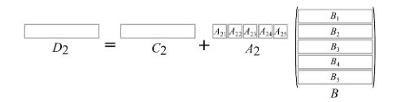


```text
# инициализация
row = (mu - 1)alpha + 1 : mu*alpha
Aloc = A(row,:) 
Bloc = B(row,:) 
Cloc = C(row,:)  
left, right  

for j = 1 : p 
	send(Bloc, right)
	recv(Bloc, left)  
	# определение индекса полученного блока B_tau  
	tau = mu - j;  
	if tau <= 0 then  
		tau = tau + p  
	endif  
	a = (tau - 1)alpha + 1:tau*alpha;  
	# индексы, задающие блочную строку tau матр. B  
	Cloc = Cloc + Aloc(:, a) * Bloc;
end for
```

## 25. !Систолический алгоритм умножения матриц на торе.!

**Далее будем говорить о производстве операции** 

$$
D = C + AB,
$$

**На основе линейной комбинации блочных столбцов и строк:**

**$$D_{\mu,\lambda} = C_{\mu,\lambda} + A_\mu B_\lambda = C_{\mu,\lambda} + \sum_{k=1}^{N} A_{\mu,k} B_{k,\lambda}$$**

**где пара $(\mu, \lambda)$ — двузначный номер задачи ($1 \le \mu \le N$ и $1 \le \lambda \le N$, $N = \sqrt{p}$), блоки с двойными индексами $A_{\mu,k}, B_{\mu,\lambda}, D_{\mu,\lambda}, C_{\mu,\lambda} \in \mathbb{R}^{\alpha \times \alpha}$, ($\alpha = n/N$);**

Стремясь исключить дублирование данных и снизить объем занимаемой памяти разработаем алгоритм с коммуникациями на торе. 

**Пусть отправка блоков матрицы A производится в горизонтальном направлении с востока на запад, блоков матрицы B в вертикальном – с юга на север. Задачи, расположенные на крайнем западе тора связаны каналами с задачами крайнего востока, расположенные на крайнем севере связаны с задачами крайнего юга.** 

**Тогда у задачи $(\mu, \lambda)$ будет четыре соседа: западный — $(\mu, \lambda-1)$, при $\lambda=1$ $(\mu, N)$; северный — $(\mu-1, \lambda)$, при $\mu=1$ $(N, \lambda)$; восточный — $(\mu, \lambda+1)$, при $\lambda=N$ $(\mu, 1)$ и южный — $(\mu+1, \lambda)$, при $\mu=N$ $(1, \lambda)$.**

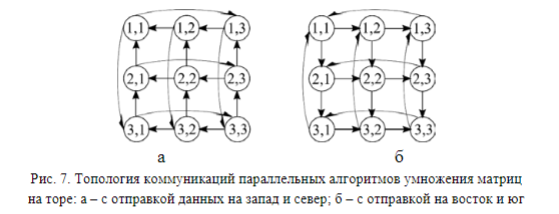

**Важной особенностью искомого алгоритма является начальное распределение данных. Необходимо, чтобы перед началом вычислений в памяти задачи $(\mu, \lambda)$ находились блоки $C_{\mu,\lambda}$, $A_{\mu,\rho}$ и $B_{\rho,\lambda}$, где $\rho = \langle \lambda + \mu - 1 \rangle_N$. Последняя операция связана с делением с остатком значения $\lambda + \mu - 1$ (делимое) на $N$ (делитель). При нулевом остатке положим $\rho = N$, при отличном от нуля примем $\rho$ равным этому остатку.**

**Если предварительно отнести к задаче $(\mu, \lambda)$ блоки $A_{\mu,\lambda}$ и $B_{\mu,\lambda}$, то в ходе начального распределения данных необходимо сдвинуть циклически $\mu$-ую блочную строку матрицы $A$ на $\mu-1$ позицию влево, а блочный столбец $\lambda$ матрицы $B$ на $\lambda-1$ позицию вверх.**

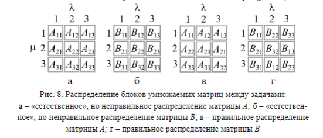

**Алгоритм с неправильным распределением:**

```text
# инициализация
row=(mu-1)*alpha+1:mu*alpha;
col=(lambda-1)*beta+1:lambda*beta;

Aloc=A(row,col);
Bloc=B(row,col);   

east, west, north, south

for k=1:mu-1 # циклическое смещение блочной строки μ матрицы A
　　send(Aloc, west); recv(Aloc, east) # на mu-1 позицию влево
endfor

for k=1:lambda-1 # циклическое смещение блочн. столбца lambda матрицы B
　　send(Bloc, north); recv(Bloc, south) # на lambda-1 позицию вверх
endfor
```

**Алгоритм c правильным распределением:**

```text
# инициализация
row=(μ-1)*alpha+1:μ*alpha; 
a=(beta-1)*alpha+1:beta*alpha
col=(lambda-1)*alpha+1:lambda*alpha; 

Cloc=C(row,col); 
Aloc=A(row,a); 
Bloc=B(a,col); 

east, west, north, south;

for k=1:N 　　
	send(Aloc, west)
	send(Bloc, north)
	recv(Aloc, east)
	recv(Bloc, south)
	Cloc=Cloc+Aloc*Bloc 
endfor
```

## 26. Параллельный алгоритм разложения Холецкого на кольце.

Далее будем говорить о выводе параллельного алгоритма разложения Холецкого $A = GG^T$, где матрица $A \in \mathbb{R}^{n \times n}$ — симметричная положительно определенная, а $G \in \mathbb{R}^{n \times n}$ — нижняя треугольная с положительными элементами на главной диагонали.

**Алгоритм:**

```text
# инициализация
col = mu:p:n
L=lenght(col)
A_loc=A(:,1:L)
left, right
j = 1
l = 1
# локальный индекс столбца J подлежит вычислению в первую очередь любой задачей
# индекс столбца J только вычисляется или подлежит вычислению только
# в первую очередь той задачей в локальной памяти которой он хранится
# j у всех одинаковый, l может быть у всех различный
while l ≤ L then
    # произвольная задача не выйдет из цикла до тех пор
    # пока не вычислит все свои локальные столбцы,
    # в одной итерации цикла мы вычисляем j-ий столбец и используем его максимальным образом

    if j = col(l) then
        A_loc(j:n,l)=A_loc(j:n,l)*sqrt(A_lk(j,l))
        if j≠n then
            send(A_lk(j:n,l),right)
        endif

        for g=l+1:L
            r=col(g)
            A_loc(r:n,q)=A_loc(r:n,q)-A_loc(r:n,l)*A_loc(r,l)
        endfor
        j=j+1
        l=l+1
    else
        recv(g(j:n),left)
        if (right≠alpha) and (j<beta) then
            # alpha - номер задачи, породившая j-ий столбец
            # alpha можно не вычислять, а передавать по кольцу вместе с индексом j
            # beta - глобальный индекс последнего локального столбца правого соседа

            send(g(j:n),right)
        endif
        for q=l:L
            r=col(q)
            A_loc(r:n,q)=A_loc(r:n,q)-g(r:n)*g(r)
        endfor
        j=j+1
        l=l
    endif
endwhile
```
## 27. ???Параллельный алгоритм LU-разложения на кольце.

## 28. ???Параллельный алгоритм метода прогонки.

# ХАРАКТЕРИСТИКИ ПАРАЛЛЕЛЬНЫХ АЛГОРИТМОВ

## 29. Ускорение, эффективность, масштабируемость, закон Амдала.

**Ускорение (speedup):** $S = \frac{T'}{T^{p}}$

$T'$ - время работы последовательного

$T^{p}$ - время работы параллельного, $p$ - число задач

**Смысл ускорения** - во сколько раз вычисления по параллельному алгоритму производятся быстрее чем по последовательному

**Эффективность (effecintly):** $E = \frac{S}{p} =\frac{T'}{T^pp} * 100\%$

**Смысл эффективности** - указать какая доля исполнительных операций занимается полезными арифметическими операциями

**Масштабируемость (scaleability):** $M = \frac{V^p}{V'}$, при $T' = T^p$

$V^p$ -объем памяти

$V'$ - объем памяти при последовательном алгоримте

**Смысл масштабируемости** - это свойство алгоритма допускающее эффективное задействование большего количества исполнительных устройств с ростом объемов входных данных


Пункт 4.1.2.1 Закон Амдала (1957)

$t'$ - время выполнения операций, которые не распараллелить 

$\gamma = \frac{t'}{T'}$ - доля не распараллеленных операций в общем количестве

$T^p = \gamma T' + \frac{1-\gamma}T'{p}$

Тогда ускорение:

$S = \frac{T'}{\gamma T'+ \frac{1-\gamma}{p}T'} = \frac{1}{\gamma + \frac{1-\gamma}{p}}$

**Закон Амдала:** $S \leq \frac{1}{\gamma + \frac{1-\gamma}{p}}$

**Рассмотрим крайности:**

1. $p = \infty$

$S \leq \frac{1}{\gamma}$


2. $\gamma = 0$


## 30. Ускорение, эффективность, масштабируемость, учет коммуникаций при оценке эффективности, коэффициент сетевой деградации.

**Ускорение (speedup):** $S = \frac{T'}{T^{p}}$

$T'$ - время работы последовательного

$T^{p}$ - время работы параллельного, $p$ - число задач

**Смысл ускорения** - во сколько раз вычисления по параллельному алгоритму производятся быстрее чем по последовательному

**Эффективность (effecintly):** $E = \frac{S}{p} =\frac{T'}{T^pp} * 100\%$

**Смысл эффективности** - указать какая доля исполнительных операций занимается полезными арифметическими операциями

**Масштабируемость (scaleability):** $M = \frac{V^p}{V'}$, при $T' = T^p$

$V^p$ -объем памяти

$V'$ - объем памяти при последовательном алгоримте

**Смысл масштабируемости** - это свойство алгоритма допускающее эффективное задействование большего количества исполнительных устройств с ростом объемов входных данных


Пункт 4.1.2.2 Учет коммуникаций

Пусть изучаемый параллельный алгоритм сбалансирован, то есть совокупное время арифметический операций и коммуникаций для любой из его задач одинакова, начало и конец вычислений производится всеми задачами одновременно и для всех задач одинакова длительность арифметических операций и коммуникаций. 

При этом в любой произвольный момент времени разные задачи могут делать разное.

Если мы накладываем и это требование (в любой момент времени все делают одно и тоже, пусть и над разными данными), то алгоритм называют **систолическим**. 

Любой **систолический** алгоритм всегда **сбалансирован**, обратное неверно.

**Далее исключительно о сбалансированных алгоритмах.**

$t_{a}$ - общее время производства арифметических операций для любой задачи

$t_{k}$ - общее время производства коммуникаций для любой задачи

Тогда:

$S = \frac{t_{a}*p}{t_{a} + t_{k} } = \frac{p}{1+\frac{t_{k}}{t_{a}}}$

$k$ - **коэффициент сетевой деградаций**

$E = \frac{1}{1+k}$

**Распишем коэффициент сетевой деградации:**

$k = \frac{t_{k}}{t_{a}} = \frac{q\hat{t_{k}}}{Q \hat{t_{a}}}$

$q$ - количество коммуникаций

$\hat{t_{k}}$ - время одной 

$Q$ - количество арифметических операций

$\hat{t_{a}}$ - время одной

**Разделим на две части коэффициент:**

$\frac{q}{Q}$ - алгоритмическая часть коэффициента сетевой деградации

$\frac{\hat{t_{k}}}{\hat{t_{a}}}$ - аппаратная часть коэффициента сетевой деградации

## 31. Правила постановки вычислительных экспериментов и анализа их результатов.

Пункт 4.1.3 Экспериментальные исследования параллельных алгоритмов

Если в ходе эксперимента производятся измерения физических величин, то он натурный;

Если расчет физических величин, то теоретический (вычислительный).

**Ход исследования:**

1. Поставить цель

2. Выбор параметров + обоснования

3. Выбор программной, аппаратной и системной базы

4. Предварительные теоретические предположения (либо вторым пунктом)

5. Постановка эксперимента (в итоге таблицы и графики) - **Необходим лабораторный журнал**

6. Описание результатов (словесное, а лучше письменное) - что происходит? как происходит?

7. Анализ (сравнение теории и эксперимента) - почему происходит?

	7а. Качественно и количественно соответствовать -> завершаем эксперимент
	
	7б. Качественно соответствовать, количественно не совпадать -> повод задуматься о выборе параметров, повторить или уточнить теорию
	
	7в. Никакого соответствия -> новая теория
	
	Феноменологический подход 

8. Выводы (соответствие результата и цели)


